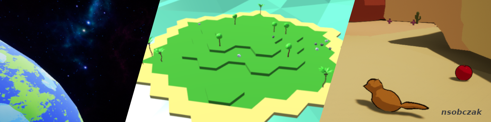

<!-- ## 👋 Welcome -->

<!--
**nsobczak/nsobczak** is a ✨ _special_ ✨ repository because its `README.md` (this file) appears on your GitHub profile.

Here are some ideas to get you started:

- 🔭 I’m currently working on ...
- 🌱 I’m currently learning ...
- 👯 I’m looking to collaborate on ...
- 🤔 I’m looking for help with ...
- 💬 Ask me about ...
- 📫 How to reach me: ...
- 😄 Pronouns: ...
- ⚡ Fun fact: ...

- 🎮 Games on [https://nsobczak.itch.io/](https://nsobczak.itch.io/)
-->

<!--
___

-->

<!--
*Follow me:*

  <a href="https://trucverte.itch.io/" target="_blank">
    <svg xmlns="http://www.w3.org/2000/svg" xmlns:xlink="http://www.w3.org/1999/xlink" width="43" height="20" role="img" aria-label="itch.io"><title>itch.io</title><linearGradient id="s" x2="0" y2="100%"><stop offset="0" stop-color="#bbb" stop-opacity=".1"/><stop offset="1" stop-opacity=".1"/></linearGradient><clipPath id="r"><rect width="43" height="20" rx="3" fill="#fff"/></clipPath><g clip-path="url(#r)"><rect width="0" height="20" fill="#e05d44"/><rect x="0" width="43" height="20" fill="#e05d44"/><rect width="43" height="20" fill="url(#s)"/></g><g fill="#fff" text-anchor="middle" font-family="Verdana,Geneva,DejaVu Sans,sans-serif" text-rendering="geometricPrecision" font-size="110"><text aria-hidden="true" x="215" y="150" fill="#010101" fill-opacity=".3" transform="scale(.1)" textLength="330">itch.io</text><text x="215" y="140" transform="scale(.1)" fill="#fff" textLength="330">itch.io</text></g></svg>
  </a>

___
-->
